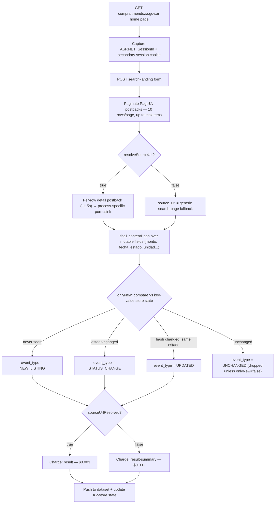

<h1 align="center">Mendoza COMPR.AR Argentina - Tender Delta API</h1>

<p align="center"><strong>Delta-mode monitoring for Mendoza Province's public tenders (licitaciones) and direct-award contracts — no session cookies to babysit, no manual re-checks of comprar.mendoza.gov.ar.</strong></p>

<p align="center">
  <a href="https://apify.com"></a>
  
  
  <a href="./LICENSE"></a>
</p>

<p align="center">
  <a href="https://apify.com/stefano_seggio/mendoza-compras-monitor"></a>
</p>

<p align="center"><sub>Owner console: <a href="https://console.apify.com/actors/bb4cRgt1i27hvr9Ug">console.apify.com/actors/bb4cRgt1i27hvr9Ug</a></sub></p>

**Monitors `comprar.mendoza.gov.ar` — the Province of Mendoza, Argentina's official public procurement portal (licitaciones and contrataciones directas) — and runs on whatever Apify schedule you configure; there is no fixed built-in cadence.**

## What it does

`comprar.mendoza.gov.ar` — the Province of Mendoza, Argentina's official public procurement portal — publishes every licitación pública (competitive tender) and contratación directa (direct-award contract) issued by provincial organisms, but only through a session-bound ASP.NET advanced-search form with no plain, bookmarkable listing URLs and no change feed. Checking whether a tracked process changed status means re-running the same search and eyeballing a register of 25,000+ processes by hand.

This Actor walks that register on a schedule and turns it into a proper feed: type, status (`estado`), executing organism (`unidadEjecutora`) and budget (`monto`) per process, plus two checks the portal itself never surfaces — a status change (e.g. "Pendiente Análisis" → "Adjudicado") and a content amendment (budget, opening date, organism, or any other tracked field) — both detected from the same row this Actor already reads, at no extra request cost. Turn on delta mode (`onlyNew`) and every scheduled run reports only what's new, status-changed, or amended, instead of a full re-dump of the register.

It's built for suppliers tracking their own submitted bids, bid consultants and gestores managing several client accounts at once, and journalists or transparency researchers studying which organisms lean on lower-scrutiny Contratación Directa awards versus competitive Licitación Pública.

## How it works



Every request in that sequence — the home-page GET, the search-landing POST, each pagination postback, and each per-row detail postback — goes through a shared retry helper with exponential backoff (up to 4 retries, starting at 1 second and doubling). No proxy is required; the portal is reachable from a plain datacenter IP.

## Features

| Feature | Input field | What it does |
| --- | --- | --- |
| Delta mode | `onlyNew` | Persists each `numeroProceso`'s last-known `estado` and content fingerprint in a named key-value store that survives between scheduled runs, then delivers only new, status-changed or amended records. |
| Status-change detection | `eventTypes` (`STATUS_CHANGE`) | Flags a process whose `estado` changed since it was last seen — free to detect, reused from the same grid row already walked. |
| Content-amendment detection | `eventTypes` (`UPDATED`) | Flags a process whose `monto`, `fechaApertura`, `unidadEjecutora` or other tracked field changed while `estado` stayed the same, via a sha1 `contentHash`. |
| Event-type filtering | `eventTypes` | Narrows delta-mode delivery to any subset of `NEW_LISTING` / `STATUS_CHANGE` / `UPDATED`. |
| Per-process permalink resolution | `resolveSourceUrl` | Resolves a process-specific link via one extra postback per row; disabling it trades the specific link for a faster, cheaper run. |
| Opening-date filter | `dateRange` | Filters the raw walk to processes whose `fechaApertura` (scheduled bid-opening date) falls in the last 24h / 7d / 30d. |
| Configurable walk size | `maxItems` | Hard cap on raw processes walked per run (10 rows/page against a 25,000+ process register at audit time). |
| Resilient session handling | — | Captures and forwards `ASP.NET_SessionId` and a second opaque session cookie across the whole postback sequence, with exponential-backoff retries on every request. |

## Cost & BYOK Disclosure

**No third-party key required.** This Actor needs nothing beyond your Apify account — there is no BYOK requirement and no separate `comprar.mendoza.gov.ar` credential involved.

| Event | Price | Charged when |
| --- | --- | --- |
| `result` | $0.003 per record | A delivered record's `source_url` was genuinely resolved this run (default `resolveSourceUrl: true`). |
| `result-summary` | $0.001 per record | `resolveSourceUrl` was disabled, or the per-row permalink postback failed — `source_url` falls back to the generic search page. |

Precise figures live on the [Apify Store listing](https://apify.com/stefano_seggio/mendoza-compras-monitor) pricing tab, which is the pricing source of truth for this Actor — the table above lists the two real event names and what triggers them.

**Unchanged records are never billed.** Every walked process is fingerprinted with a sha1 `contentHash` over its mutable fields (`monto`, `fechaApertura`, `estado`, `unidadEjecutora`, ...) and compared against the last-known state in a named key-value store; a process whose `estado` and `contentHash` still match what this Actor delivered on a previous run is suppressed before delivery — it never reaches the dataset and is never charged. Nothing is charged for rows the raw walk reads but doesn't deliver — `onlyNew`, `eventTypes` and `dateRange` are all free post-filters on top of the same walk, so a delta run that finds nothing new that day costs only its per-run start fee. A daily monitor finding 5 changes with `resolveSourceUrl: true` runs about $0.02/day (~$0.45/month); disabling permalink resolution over a larger `maxItems` window is cheaper and faster still, at the cost of a generic link instead of a process-specific one.

## Quickstart

Also runnable from the [Apify Console](https://console.apify.com/actors/bb4cRgt1i27hvr9Ug) or the [Apify CLI](https://docs.apify.com/cli):

```bash
apify call stefano_seggio/mendoza-compras-monitor --input '{
  "maxItems": 500,
  "onlyNew": true,
  "eventTypes": ["NEW_LISTING", "STATUS_CHANGE", "UPDATED"],
  "resolveSourceUrl": true
}'
```

This walks up to 500 raw processes, keeps only records that are new, status-changed or amended since the last run, and resolves a process-specific permalink for each one delivered.

### cURL (instant terminal run)

Runs synchronously and returns the resulting dataset items directly in the response - no polling needed. Get your token from [console.apify.com/settings/integrations](https://console.apify.com/settings/integrations).

```bash
curl -X POST "https://api.apify.com/v2/acts/bb4cRgt1i27hvr9Ug/run-sync-get-dataset-items?token=<YOUR_API_TOKEN>" \
  -H "Content-Type: application/json" \
  -d '{
  "maxItems": 50,
  "onlyNew": true
}'
```

### Python (`apify_client`)

```python
# run_monitor.py
# Calls the Mendoza Tender Delta Actor via the Apify API and logs new/changed tender records.
import os
from apify_client import ApifyClient

client = ApifyClient(os.environ["APIFY_TOKEN"])  # set this to your Apify API token

run_input = {
    "maxItems": 500,
    "onlyNew": True,
    "eventTypes": ["NEW_LISTING", "STATUS_CHANGE", "UPDATED"],
    "resolveSourceUrl": True,
}

# Starts the run and waits for it to finish
run = client.actor("stefano_seggio/mendoza-compras-monitor").call(run_input=run_input)
print(f"Run {run['id']} finished with status: {run['status']}")

# Fetch the delivered tender records for this run
dataset_items = client.dataset(run["defaultDatasetId"]).list_items().items
print(f"Delivered {len(dataset_items)} tender record(s):")
for item in dataset_items:
    print(f"- [{item['event_type']}] {item['numeroProceso']}: {item['nombreProceso']} ({item['estado']})")
```

A full, runnable copy of this script lives at [`examples/run_monitor.py`](./examples/run_monitor.py).

### Node.js (`apify-client`)

```js
// run-monitor.js
// Calls the Mendoza Tender Delta Actor via the Apify API and logs new/changed tender records.
const { ApifyClient } = require('apify-client');

const client = new ApifyClient({
    token: process.env.APIFY_TOKEN, // set this to your Apify API token
});

async function main() {
    const input = {
        maxItems: 500,
        onlyNew: true,
        eventTypes: ['NEW_LISTING', 'STATUS_CHANGE', 'UPDATED'],
        resolveSourceUrl: true,
    };

    // Starts the run and waits for it to finish
    const run = await client.actor('stefano_seggio/mendoza-compras-monitor').call(input);
    console.log(`Run ${run.id} finished with status: ${run.status}`);

    // Fetch the delivered tender records for this run
    const { items } = await client.dataset(run.defaultDatasetId).listItems();
    console.log(`Delivered ${items.length} tender record(s):`);
    for (const item of items) {
        console.log(`- [${item.event_type}] ${item.numeroProceso}: ${item.nombreProceso} (${item.estado})`);
    }
}

main().catch((err) => {
    console.error('Run failed:', err);
    process.exit(1);
});
```

A full, runnable copy of this script lives at [`examples/run-monitor.js`](./examples/run-monitor.js).

## Input & Output Schema

### Input

Field definitions come straight from [`.actor/input_schema.json`](./.actor/input_schema.json).

| Field | Type | Default | Description |
| --- | --- | --- | --- |
| `maxItems` | integer | `20` | Hard cap on the number of RAW processes walked this run (10 per page, 25,000+ total at audit time). `onlyNew`/`dateRange` are post-filters on top of this raw walk, so delivered records can be fewer than `maxItems`. Kept low by default because `resolveSourceUrl`'s per-row postback (~1.5s each) makes a large blank run take several minutes; raise it for a real monitoring run. |
| `onlyNew` | boolean | `false` | Delta mode - see Reliability below. The portal's listing is sorted by número de proceso ascending, not by date, so this is a post-filter, not an early stop. |
| `eventTypes` | string[] | `["NEW_LISTING", "STATUS_CHANGE", "UPDATED"]` | Which kinds of change to deliver when `onlyNew` is on (ignored, everything delivered, when it's off). `NEW_LISTING` = never seen before. `STATUS_CHANGE` = `estado` changed. `UPDATED` = a field changed, same `estado`. |
| `resolveSourceUrl` | boolean | `true` | Resolves each delivered record's own permalink via one extra postback per row (~1.5s each). Disable for a faster run: `source_url` falls back to the plain search page, billed at the cheaper `result-summary` rate. |
| `dateRange` | string (enum) | - | `24h` / `7d` / `30d` - restricts the raw walk to processes whose `fechaApertura` (scheduled bid-opening date) falls in this window ending now. Independent of `onlyNew`. |

### Output

One real record from this Actor's own dataset, matching `.actor/dataset_schema.json`:

```json
{
  "numeroProceso": "10201-0034-CDI26",
  "nombreProceso": "Adquisicion de insumos de laboratorio para Hospital Central",
  "tipoProceso": "Contratacion Directa",
  "fechaApertura": "18/09/2026 10:00",
  "estado": "Adjudicado",
  "unidadEjecutora": "Hospital Central",
  "servicioAdministrativoFinanciero": "Ministerio de Salud",
  "monto": "4.850.000,00",
  "record_id": "10201-0034-CDI26",
  "event_type": "STATUS_CHANGE",
  "scraped_at": "2026-09-15T14:02:11.000Z",
  "is_new": false,
  "contentHash": "b7e1c4a9f02d3856e1a4c9d7f0b2e5a8c3d6f1e9",
  "sourceUrlResolved": true,
  "source_url": "https://comprar.mendoza.gov.ar/PLIEGO/VistaPreviaPliegoCiudadano.aspx?qs=a1b2c3d4"
}
```

| Field | Description |
| --- | --- |
| `numeroProceso` | Process number, e.g. `10201-0001-CDI20`. |
| `nombreProceso` | Process name/title as published by the portal. |
| `tipoProceso` | e.g. `Contratacion Directa`, `Licitacion Publica`. |
| `fechaApertura` | Scheduled bid-opening date/time, portal's raw format. |
| `estado` | Current process status. |
| `unidadEjecutora` | Executing organism/unit. |
| `servicioAdministrativoFinanciero` | Administrative/financial service, e.g. the ministry. |
| `monto` | Budget amount, raw comma-decimal string exactly as the portal renders it (not parsed into a number, to avoid a silent reformatting error on Argentine number formatting). |
| `record_id` | Same value as `numeroProceso` - stable across runs. |
| `event_type` | `NEW_LISTING`, `STATUS_CHANGE`, `UPDATED`, or `UNCHANGED` (only when `onlyNew` is off). |
| `scraped_at` | ISO-8601 timestamp of this extraction. |
| `is_new` | `true` if not seen in a prior run (delta mode). |
| `contentHash` | sha1 fingerprint of this record's changeable fields, used to detect `UPDATED` between runs. |
| `sourceUrlResolved` | `true` when `source_url` is a genuine process-specific permalink; `false` when it's the generic search-page fallback. |
| `source_url` | Direct, cookie-independent link to the official process page (or the generic search page - see `sourceUrlResolved`). |

## Reliability

- **Crash-safe delivery**: memory (each `numeroProceso`'s last-known `estado` and content fingerprint) is written to a named key-value store that survives between scheduled runs.
- **Retry with backoff**: every request in the session/postback sequence - the home-page GET, the search-landing POST, each pagination postback, and each per-row detail postback - goes through a shared retry helper with exponential backoff (up to 4 retries, starting at 1 second and doubling). No proxy is required.
- See Known limitations below for how `onlyNew` behaves as a post-filter rather than an early-stop.

## Why not just scrape it yourself

- **Zero infrastructure** — no session-handling code, no scheduler process, no server to keep alive; the Actor runs on Apify's platform on the schedule you set.
- **Managed scheduling** — set it once as an Apify scheduled task and every run picks up exactly where the last one left off via the persisted delta state.
- **No proxy or session babysitting** — the ASP.NET session cookie pair and postback sequencing that `comprar.mendoza.gov.ar` requires are already handled request-by-request, with backoff retries built in.
- **Built-in change detection** — `STATUS_CHANGE` and `UPDATED` are computed from data already collected in the same page walk, at no extra request or cost, instead of you diffing raw HTML across runs yourself.

## Known limitations

- **`onlyNew` is a post-filter, not an early-stop.** The portal's listing is sorted by número de proceso ascending (each organism's own sequential counter cycling through years), not by date or newest-first — verified live, a blank-form search's first page mixes processes from 2019 through 2026. Delta mode still walks up to `maxItems` raw processes every run before filtering; it does not guarantee a newly created process appears within a small `maxItems` window.
- **No `CLOSED` event.** Detecting that a previously-seen process disappeared from the register would require a complete census of all 25,000+ processes — unlike smaller provincial registers, that would take thousands of sequential postbacks per run. This was considered and explicitly not built.
- **The advanced search form's own filters (organism, process type) aren't exposed as input yet** — only `dateRange` (by opening date) and the raw `maxItems` walk are. Broader filter support is tracked as a Store Issues request.
- **`monto` ships as the source's raw comma-decimal string**, not parsed into a number, to avoid a silent reformatting error on Argentine number formatting.
- **No contractual support SLA.** This Actor is built and maintained by an independent developer; bug reports and filter requests go through the Apify Store's Issues tab and are typically addressed within about 48 hours.

## Contributing & Local Setup

This repository contains the Actor's real, buildable TypeScript source (`src/`) — there is no proprietary logic held back from GitHub. To work on it locally:

```bash
git clone https://github.com/stefanoseggio/mendoza-compras-monitor.git
cd mendoza-compras-monitor
npm install

# Run against the real comprar.mendoza.gov.ar portal, Apify-CLI style:
apify login          # one-time, needs an Apify account
apify run             # runs src/main.ts via the Apify SDK's local dev flow

# Or run the TypeScript entrypoint directly:
npm run start:dev     # tsx src/main.ts

# Build, lint and test before opening a PR:
npm run build          # tsc
npm run lint
npm test               # vitest run (mocked fixtures)
```

Source layout: `src/main.ts` (Actor entrypoint and session/postback walk), `src/fetchTenders.ts` (listing pagination), `src/parsers/` (HTML row parsing), `src/fingerprint.ts` (sha1 `contentHash`), `src/dateFilter.ts` (`dateRange` filtering), `src/state.ts` (delta key-value store), `src/types.ts` (shared types). Real unit tests live in `test/` with fixture-based coverage for parsing, date filtering and tender fetching.

Bug reports and feature requests are handled through the Apify Store **Issues** tab for this Actor (see Known limitations above) rather than GitHub Issues, since that is where paying users of the published Actor already are — but pull requests against this repository are welcome.

## License

The source code in this repository is licensed under the [Apache License 2.0](./LICENSE).

---

<p align="center">
Part of <strong>Delta Registry</strong> — pay-per-event regulatory &amp; compliance data infrastructure.<br>
For professional inquiries or enterprise licensing: <a href="https://www.linkedin.com/in/stefanoseggio-deltaregistry">linkedin.com/in/stefanoseggio-deltaregistry</a><br>
The rest of the fleet: <a href="https://github.com/stefanoseggio">github.com/stefanoseggio</a>
</p>
